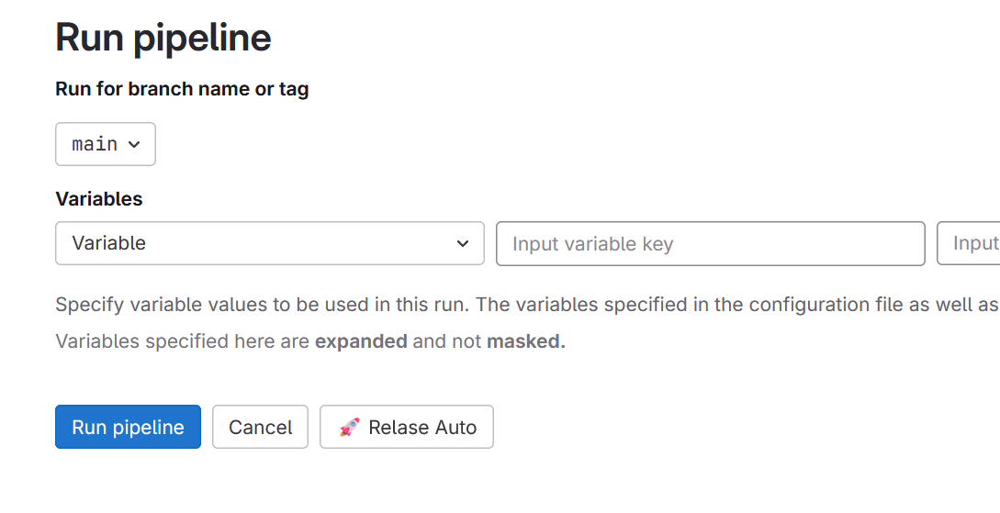
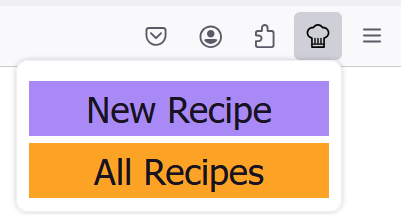
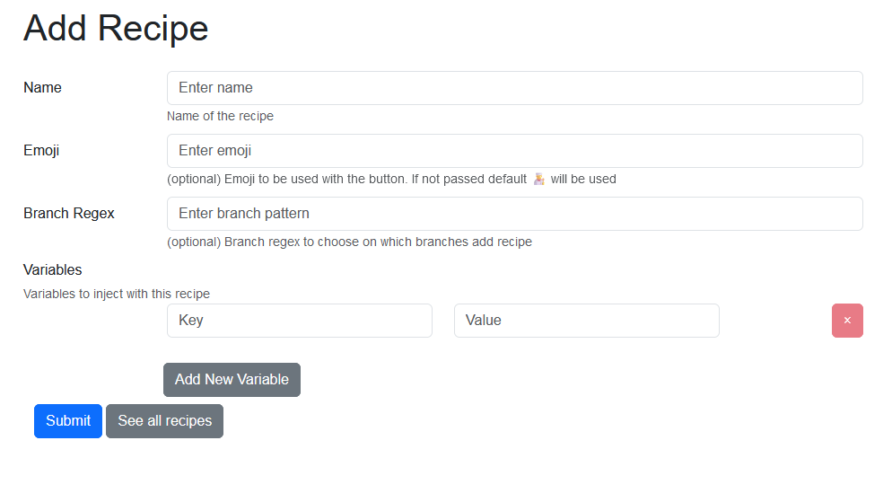
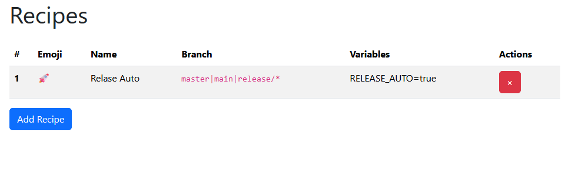

# Gitlab Chef

Gitlab Chef is a plugin designed to enhance your GitLab CI/CD experience by providing additional functionality to the pipeline view. This plugin allows you to add extra buttons on the new pipeline view, offering a more streamlined and customizable way to run pipelines.

## Features

 - **Customizable Buttons**: Add extra buttons to the pipeline view, making it easier to trigger specific pipeline configurations with a single click.
 - **Recipe-Based Configuration**: Each button corresponds to a "recipe," a set of key-value pairs that are automatically injected into GitLab CI/CD variables when the pipeline is triggered. This enables you to quickly apply predefined settings and configurations to your pipelines.

## Popup

Gitlab Chef includes a convenient popup interface that provides two primary functions:

 - **View All Recipes**: Quickly browse through all existing recipes.
 - **Add New Recipe**: Easily create new recipes to customize your pipeline execution.

## New Recipe 

To add a new recipe, simply select the option from the popup and complete the required fields:

 - **Name**: The name of the recipe. This name will be displayed as the label on the corresponding button in the new pipeline view.
 - **Emoji (Optional)**: An emoji that will be used on the button. If not specified, the default 👨‍🍳 emoji will be used.
 - **Branch Regex (Optional)**: A JavaScript regular expression that determines on which branches the button will appear. If left empty, the button will be available on all pipeline pages.
 - **Variables**: A list of key-value pairs that will be injected into the pipeline when the button is selected.

## All Recipes

The "All Recipes" page provides an overview of all your existing recipes. From this page, you can easily manage your recipes, including the ability to remove any that are no longer needed.

